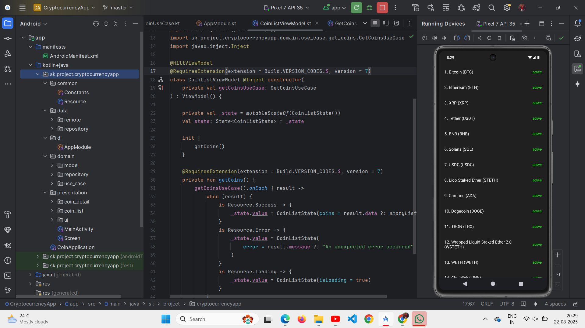
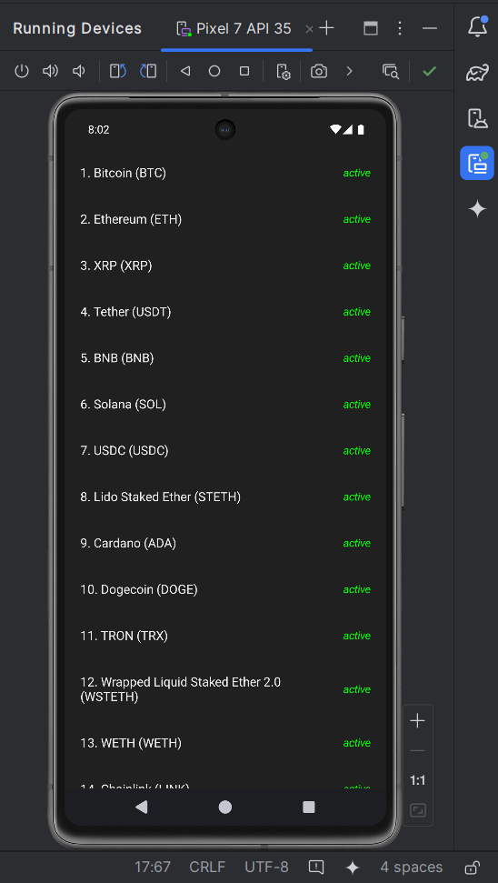
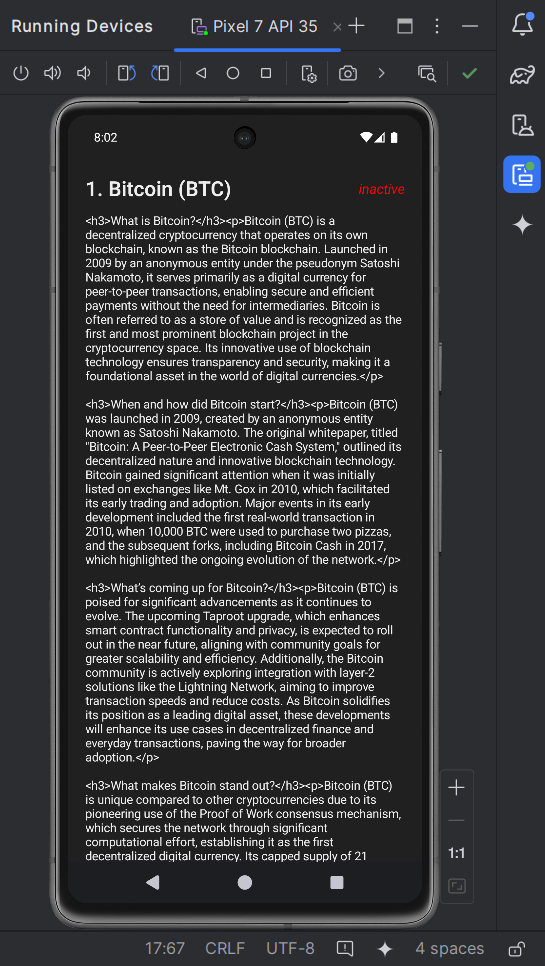
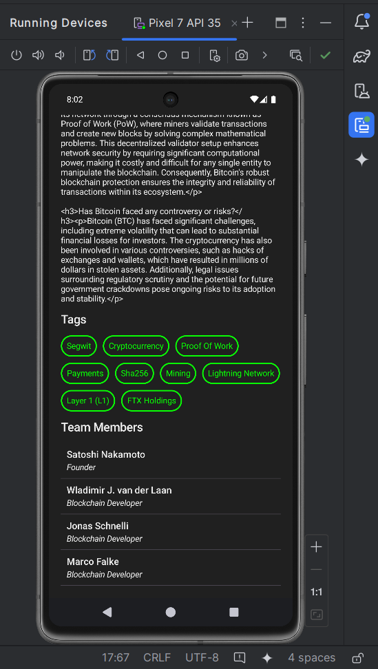

<h1 align="center">💰 CryptocurrencyApp</h1>

<p align="center">
  
  
  
  
</p>

---

## 📱 Project Overview

**CryptocurrencyApp** is a modern Android application built using **MVVM architecture** and **Clean Architecture principles**.  
It fetches real-time cryptocurrency data from the **CoinPaprika REST API** to display a list of coins and their detailed information using **Retrofit** integration.

---

## 🔧 Features

<ul>
  <li>MVVM + Clean Architecture for clean separation of concerns</li>
  <li>UseCases to handle business logic</li>
  <li>Repository pattern with interface & implementation</li>
  <li>Retrofit for API requests and JSON parsing</li>
  <li>Coroutines for asynchronous operations</li>
  <li>Hilt for Dependency Injection</li>
  <li>Sealed class <code>Resource</code> for loading, success, and error state handling</li>
  <li>Modern, scalable, and maintainable architecture</li>
</ul>

---

## 📸 Screenshots

<!-- Landscape image full width -->
<p align="center">
  
</p>

<!-- Portrait images side by side with extra spacing -->
<p align="center">
  
  
  
</p>


---

## 📦 Tech Stack

- **Kotlin**
- **MVVM**
- **Clean Architecture**
- **Coroutines & Flow**
- **Retrofit**
- **Gson Converter**
- **Hilt (Dependency Injection)**
- **CoinPaprika API**

---

## 🙌 Author

**Siddhant Kudale**  
[GitHub Profile](https://github.com/siddhant0510)

---

## 🚀 How to Run

1. Clone this repository:

```bash
git clone https://github.com/siddhant0510/CryptocurrencyApp.git
